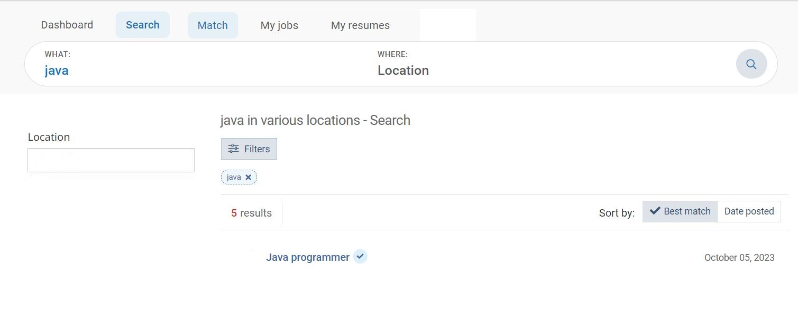

# JobsBank

JobsBank -- это площадка, на которой пользователи-компании размещают вакансии, а пользователи-соискатели свои резюме. Задача площадки -- дать возможность компании нанять наиболее подходящего работника, а соискателю найти работу.

## Визуальная схема frontend

## Документация

1. Маркетинг
    1. [Заинтересанты](./docs/01-marketing/02-stakeholders.md)
    2. [Целевая аудитория](./docs/01-marketing/01-target-audience.md)
    3. [Конкурентный анализ](./docs/01-marketing/03-concurrency.md)
    4. [Анализ экономики](./docs/01-marketing/04-economy.md)
    5. [Пользовательские истории](./docs/01-marketing/05-user-stories.md)

2. DevOps
    1. [Схема инфраструктуры](./docs/02-devops/01-infrastruture.md)
    2. [Схема мониторинга](./docs/02-devops/02-monitoring.md)

3. Приемочные тесты - [ok-marketplace-acceptance](vacancy-acceptance)

4. Архитектура
    1. [Компонентная схема](./docs/03-architecture/01-arch.md)
    2. [Интеграционная схема](./docs/03-architecture/02-integration.md)
    3. [Описание API](./docs/03-architecture/03-api.md)